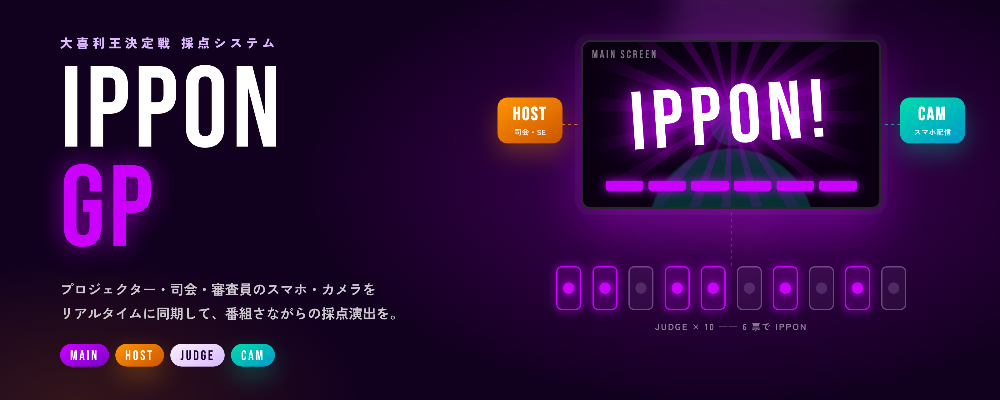

# SONG OGIRI GRAND PRIX — 大喜利王決定戦 採点システム



> 社内フェス向け「IPPON グランプリ」パロディ企画のための、リアルタイム採点・演出システム。
> 本リポジトリは [ryosuke884884-hash/ippon-gp](https://github.com/ryosuke884884-hash/ippon-gp) のフォークです。
> フォーク側で **設定駆動化・複数イベント対応・SaaS 化** を進め、汎用的な改善は本家へ還元します。

- 📍 ロードマップ: [docs/ROADMAP.md](docs/ROADMAP.md)
- 🏗️ 現行アーキテクチャ / RTDB スキーマ: [docs/ARCHITECTURE.md](docs/ARCHITECTURE.md)
- 🎬 本番 Runbook（機材・ネットワーク・当日手順・トラブル対応）: [docs/RUNBOOK.md](docs/RUNBOOK.md)
- ✅ リハーサルチェックリスト: [docs/REHEARSAL.md](docs/REHEARSAL.md)
- 💰 SaaS 化・マネタイズ設計: [docs/SAAS_DESIGN.md](docs/SAAS_DESIGN.md)
- 🔁 本家への還元方針: [docs/UPSTREAM.md](docs/UPSTREAM.md)
- 📋 バックログ: [Issues](https://github.com/75asa/ippon-gp/issues)（[マイルストーン](https://github.com/75asa/ippon-gp/milestones) M0〜M4 / Epic #5〜#9）
- 🤝 コントリビュート: [CONTRIBUTING.md](CONTRIBUTING.md)

---

## 何ができるか

会場の **プロジェクター（MAIN）**、司会の **操作端末（HOST）**、審査員の **スマホ（JUDGE）**、回答者を映す **スマホカメラ（CAM）** を Firebase Realtime Database 経由で同期し、番組さながらの採点演出を行います。

| 画面 | ファイル | 役割 |
|---|---|---|
| **MAIN** | `web/main/` | 大画面用。待機画面 / お題 / 採点フレーム / IPPON 演出 / スコアボード / OP 動画 / 紹介画像 / カメラ映像を表示 |
| **HOST** | `web/host/` | 司会・進行用。モード切替、お題出し、点数公開、スコア増減、SE（笑い・歓声・拍手・ブザー）、アジェンダ投影 |
| **JUDGE** | `web/judge/` | 審査員用。座席を選んで 1 タップ投票。6 票（設定画面で変更可）で IPPON |
| **CAM** | `web/camera/` | スマホカメラ映像を WebRTC（PeerJS）で MAIN に配信 |
| **INDEX** | `web/index.html` | 各画面へのランチャー + QR コード |
| **ADMIN** | `web/admin/` | 設定画面。回答者の名前、審査員の名前・種別・定員（1〜10 席）、IPPON に必要な票数を編集すると、各画面に即時反映 |

### 進行フロー（1 問あたり）

```
待機 → お題表示（+読み上げ音声） → 採点モード（カメラ + 採点フレーム）
   → 審査員が投票（1票ごとに効果音 + フレーム更新） → 6票で IPPON 演出
   → 「点数を公開」でバッジ表示 → スコア +1 → 結果モード（スコアボード）
```

---

## クイックスタート（現状：静的 HTML のみ）

ビルド不要。`web/` ディレクトリを任意の静的ホスティング（GitHub Pages など）に置くだけで動きます。
`main` への push で `web/` が GitHub Pages にデプロイされます（`.github/workflows/deploy-pages.yml`）。

```bash
git clone https://github.com/75asa/ippon-gp.git
cd ippon-gp
python3 -m http.server 8080 -d web   # http://localhost:8080/
```

> ⚠️ **現状の制約**: 素材ファイル名・出演者名・お題が各 HTML にハードコードされています。
> Firebase プロジェクトと Storage のベース URL は `web/config/config.js`（ひな形: `web/config/config.example.js`）で差し替えられます。
> 残りを解消する「設定駆動化」が [ロードマップ](docs/ROADMAP.md) M1 の最優先事項です（#17, #18, #19）。

### 必要なもの

- Firebase プロジェクト（Realtime Database + Storage）
- 会場 Wi‑Fi（審査員スマホ 10 台 + HOST + MAIN + CAM が同時接続できること）
- MAIN 用 PC（Chrome 推奨、音声出力を会場 PA へ）
- HOST 用 PC またはタブレット（「音マスター」= SE 再生端末）

---

## リポジトリ構成

```
.
├── web/                    # 公開ルート（GitHub Pages にはここだけデプロイ）
│   ├── index.html          # ランチャー
│   ├── main/               # 大画面
│   ├── host/               # 司会操作
│   ├── judge/              # 審査員投票
│   ├── camera/             # カメラ配信
│   ├── admin/              # 設定画面（審査員など）
│   ├── src/shared/         # 画面間で共有するモジュール（審査員の定義など）
│   ├── config/config.js    # Firebase 設定・Storage ベース URL（環境ごとに差し替え）
│   └── ippon_*.html        # 旧 URL（配布済み QR）→ 新 URL へのリダイレクト
├── firebase/               # RTDB セキュリティルール
├── tests/rules/            # セキュリティルールのテスト（エミュレータ）
├── docs/                   # 設計・計画ドキュメント
├── scripts/                # GitHub Projects のセットアップスクリプト
└── .github/                # Issue/PR テンプレート、ラベル定義、ワークフロー
```

---

## ライセンス

本家リポジトリにライセンスファイルが存在しないため、**現時点ではライセンス未確定** です。
OSS として公開・SaaS 化するには本家作者の同意が必要です（#10。依頼文面は [docs/UPSTREAM.md](docs/UPSTREAM.md)）。

---

## 開発の進め方（Issue / マイルストーン / Projects）

- バックログは **GitHub Issues が正**。Epic（#5〜#9）の下にサブ Issue をぶら下げ、マイルストーン M0〜M4 に紐付ける
- ラベルの定義は [`.github/labels.yml`](.github/labels.yml)。Actions → **Setup repo** を実行すると同期される（マイルストーンも無ければ作成）
- GitHub Projects は `gh auth refresh -s project && bash scripts/setup-project.sh 75asa 75asa/ippon-gp` で作成できる
- PR は 1 関心事、テンプレートのチェックリストを埋める。詳細は [CONTRIBUTING.md](CONTRIBUTING.md)
